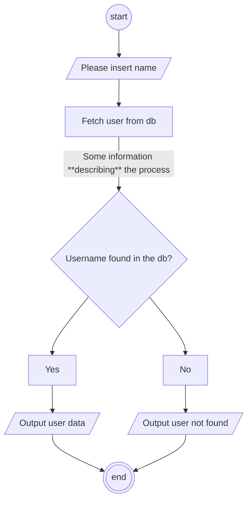

# Mermaid

## Examples

### Simple Flowchart

## Links

* [Flowchars as code mit Mermaid-JS: ordix.de](https://blog.ordix.de/flowcharts-as-code-mit-mermaid-js) - 20241108
* [Mermaid integration in cutemakred: buoa.de](https://buoa.de/wiki/mermaid-integration-in-cutemarked) - 20241108
  * [How to Use the Mermaid JavaScript Library to Create Flowcharts: freecodecamp.org](https://www.freecodecamp.org/news/use-mermaid-javascript-library-to-create-flowcharts/) - 20250114
